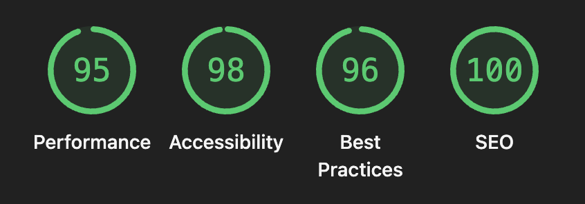

<div align="center">

# googleMe

### A Google-inspired developer portfolio — built to be searched, not scrolled.

[](https://anuragjaiswal.me)
[](https://github.com/anurag-jaiswal-aj/googleMe/actions/workflows/ci.yml)
[](LICENSE)



</div>

---

## What is this?

googleMe is a full-stack personal portfolio that reimagines the developer portfolio as a Google Search experience. Every page is a SERP (Search Engine Results Page) — complete with a sticky search bar, tabbed navigation, knowledge panel, voice search, Google Lens modal, and an AI chat assistant.

It's not just a portfolio. It's a statement about how a developer thinks about UX.

---

## Live Demo

**[anuragjaiswal.me](https://anuragjaiswal.me)**

---

## Features

| Feature | Description |
|---|---|
| Google SERP UI | Every page styled as a search results page with tabs, breadcrumbs, and sitelinks |
| Smart Search | Scored keyword routing — types "hire" → goes to Contact, "github" → Projects |
| Voice Search | Web Speech API integration with retry logic and error handling |
| Google Lens Modal | Drag-and-drop or URL-based image search simulation |
| AI Chat Mode | Built-in conversational assistant (sparkle icon) answering questions about the portfolio |
| Knowledge Panel | Right-side panel with skills, education, social profiles — visible on desktop, accessible via avatar on mobile |
| Welcome Splash | Multilingual greeting screen (20 languages) with Google color cycling |
| Admin Panel | Full CMS at `/admin` — edit every piece of content without touching code |
| Live GitHub Sync | Fetches public repos and lets you pin projects via the admin panel |
| Medium RSS | Live blog posts fetched from Medium with full in-app reader |
| Contact Form | File attachments, subject chips, Resend + SMTP fallback |
| Feedback Widget | Bug reports, feature requests, compliments — all from within the site |
| Dark / Light Mode | System preference detection + manual toggle |
| PWA | Installable, offline-capable via vite-plugin-pwa |
| Analytics | Vercel Analytics + Speed Insights |
| Multilingual UI | Home page available in 10 Indian + international languages |

---

## Tech Stack

**Frontend**
- React 18 + Vite
- TailwindCSS
- Framer Motion
- React Router v6
- Vercel Analytics + Speed Insights

**Backend**
- Node.js + Express
- MongoDB + Mongoose
- JWT authentication
- Resend / Nodemailer (email)
- Cloudinary (image CDN)
- Multer (file uploads)

**Infrastructure**
- Vercel (frontend)
- Render (backend)
- MongoDB Atlas (database)
- UptimeRobot (server keep-alive)

---

## Architecture

```
Browser
  └── Vercel CDN (React SPA)
        ├── / (Home — Google homepage style)
        ├── /all, /about, /projects, /blog, /tools, /images, /contact
        │     └── SearchLayout (sticky SERP header + knowledge panel)
        └── /admin (CMS — JWT protected)

Render (Express API)
  ├── /api/config      — site config (cached, admin-writable)
  ├── /api/projects    — MongoDB projects
  ├── /api/github      — GitHub API proxy (30min cache)
  ├── /api/medium      — Medium RSS proxy (30min cache)
  ├── /api/contact     — contact form + email
  ├── /api/feedback    — feedback form + email
  ├── /api/images      — Cloudinary gallery
  └── /api/admin       — JWT login + verify

MongoDB Atlas
  └── SiteConfig, Project, GalleryImage, Contact, Feedback, PortfolioConfig
```

---

## Folder Structure

```
googleMe/
├── client/                  # React + Vite frontend
│   ├── public/              # Static assets (favicon, resume PDF, sitemap)
│   ├── src/
│   │   ├── api/             # Axios instance + all API calls
│   │   ├── components/      # Shared UI (SearchLayout, SearchResult, KnowledgePanel, ...)
│   │   ├── config/          # Static link defaults
│   │   ├── context/         # ThemeContext
│   │   ├── data/            # Static fallback data (used when DB is empty)
│   │   ├── hooks/           # useConfig, useVoiceSearch, useImagesPageEnabled
│   │   ├── pages/           # Route-level pages
│   │   └── utils/           # aiChat, favicon, prefetch, resumeUrl, searchRoute
│   └── vercel.json          # Vercel SPA rewrite config
│
├── server/                  # Express + MongoDB backend
│   ├── middleware/          # JWT auth middleware
│   ├── models/              # Mongoose schemas
│   ├── routes/              # API route handlers
│   ├── scripts/             # One-time scripts (seed.js)
│   └── utils/               # Shared utilities (emailService)
│
├── shared/                  # projects.json fallback (used when GitHub API is down)
└── package.json             # Root scripts (dev, build, install:all, seed)
```

---

## Local Setup

### Prerequisites
- Node.js 18+
- MongoDB (local or Atlas)
- Cloudinary account (free tier)
- Resend account or Gmail App Password

### 1. Clone and install

```bash
git clone https://github.com/anurag-jaiswal-aj/googleMe.git
cd googleMe
npm run install:all
```

### 2. Configure environment variables

```bash
cp server/.env.example server/.env
cp client/.env.example client/.env
```

Fill in `server/.env` — minimum required:

```env
MONGO_URI=your_mongodb_connection_string
JWT_SECRET=any_long_random_string
ADMIN_PASSWORD_HASH=bcrypt_hash_of_your_password
```

Generate the bcrypt hash:
```bash
node -e "require('bcryptjs').hash('yourpassword', 10).then(console.log)"
```

### 3. Run in development

```bash
npm run dev
```

Client runs on `http://localhost:3000`, server on `http://localhost:5000`.

---

## Environment Variables

### Server (`server/.env`)

| Variable | Required | Description |
|---|---|---|
| `MONGO_URI` | ✅ | MongoDB connection string |
| `JWT_SECRET` | ✅ | Secret for signing admin JWTs |
| `ADMIN_PASSWORD_HASH` | ✅ | bcrypt hash of admin password |
| `GITHUB_USERNAME` | ✅ | GitHub username for repo sync |
| `GITHUB_TOKEN` | Optional | PAT for higher GitHub rate limits |
| `RESEND_API_KEY` | Optional | Resend API key (preferred email provider) |
| `RESEND_FROM` | Optional | Verified sender email for Resend |
| `EMAIL_USER` | Optional | Gmail address (SMTP fallback) |
| `EMAIL_PASS` | Optional | Gmail App Password |
| `EMAIL_TO` | Optional | Where to receive contact emails |
| `CLOUDINARY_CLOUD_NAME` | Optional | Cloudinary cloud name |
| `CLOUDINARY_API_KEY` | Optional | Cloudinary API key |
| `CLOUDINARY_API_SECRET` | Optional | Cloudinary API secret |

### Client (`client/.env`)

| Variable | Required | Description |
|---|---|---|
| `VITE_API_URL` | Optional | Backend API URL (auto-detected in production) |

---

## Deployment

### Frontend → Vercel

1. Import repo in Vercel, set root directory to `client`
2. Add env var: `VITE_API_URL=https://your-render-app.onrender.com/api`
3. Deploy

### Backend → Render

1. Create Web Service, root directory: `server`
2. Build command: `npm install`
3. Start command: `node index.js`
4. Add all env vars from `server/.env.example`

### Keep server alive (free tier)

Set up [UptimeRobot](https://uptimerobot.com) to ping `https://your-render-app.onrender.com/api/health` every 5 minutes — prevents cold starts on Render's free tier.

---

## API Endpoints

| Method | Endpoint | Auth | Description |
|---|---|---|---|
| GET | `/api/health` | — | Health check |
| GET | `/api/config` | — | Get site config |
| POST | `/api/config` | Admin | Update site config |
| GET | `/api/projects` | — | Get pinned projects |
| GET | `/api/github/repos` | — | Fetch GitHub repos |
| POST | `/api/github/selection` | Admin | Save pinned repos |
| GET | `/api/medium` | — | Fetch Medium posts |
| POST | `/api/contact` | — | Submit contact form |
| POST | `/api/feedback` | — | Submit feedback |
| GET | `/api/images` | — | Get gallery images |
| POST | `/api/images` | Admin | Upload image |
| PATCH | `/api/images/:id` | Admin | Update image metadata |
| DELETE | `/api/images/:id` | Admin | Delete image |
| POST | `/api/admin/login` | — | Admin login |
| POST | `/api/admin/verify` | — | Verify JWT token |

---

## Admin Panel

Navigate to `/admin` and enter your admin password. From there you can:

- Edit bio, skills, education, experience, certifications
- Pin/unpin GitHub repos on the Projects page
- Upload and manage gallery images
- Update social links, resume URL, Medium username
- Toggle pages (Images, Blog, Toolkit) on/off

---

## Roadmap

- [ ] Project detail pages with full case studies
- [ ] Blog post creation directly from admin (without Medium)
- [ ] Visitor analytics dashboard in admin panel
- [ ] Internationalization (i18n) for full site content
- [ ] GitHub contribution graph widget

---

## Author

**Anurag Jaiswal**
Full-Stack Developer · B.Tech ISE · Bengaluru

[](https://anuragjaiswal.me)
[](https://www.linkedin.com/in/anuragjaiswal5826/)
[](https://github.com/anurag-jaiswal-aj)

---

## License

MIT © Anurag Jaiswal
